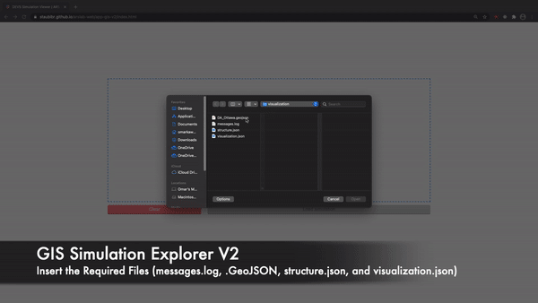

# GIS Simulation Explorer V2 (DRAFT)

This project is under development. 

## Purpose

Build a GIS environment based visualization for large scale spatial simulations on the web. 

## Features

- Unlike [V1 of the GIS Simulation Explorer](https://staubibr.github.io/arslab-web/app-gis/index.html), V2 does the data fetching from the server side
  - ```Visualization.json``` provided by end users
  - ```Application.json``` provided by programmers
- Map container
  - By default the view is set to Ottawa
  - View vector data (points, lines and polygons)
  - Vector data playback
  - Layer switcher to hide / show layers and base maps
  - Dropdown menu to swap between variables to visualize  
  - Zoom in / out
  - Map scale
  - Full screen mode

## Getting Started

### Users 
[]()
- Open to the [file upload page](https://staubibr.github.io/arslab-web/app-gis-v2/index.html) in Chrome
- Upload 4 files
  - .GeoJSON
  - messages.log
  - structure.json
  - visualization.json
- Load the simulation
- Select a variable you'd like to visualize
- Press play and record

### Developers

- Download [Web Server for Chrome](https://chrome.google.com/webstore/detail/web-server-for-chrome/ofhbbkphhbklhfoeikjpcbhemlocgigb)
- Use [Chrome DevTools](https://developers.google.com/web/tools/chrome-devtools/) for debugging
  - Ensure that cache is disabled in DevTools

## TODO
- Min / Max color for heatmap
  - https://openlayers.org/en/latest/examples/heatmap-earthquakes.html
  - https://openlayers.org/en/latest/apidoc/module-ol_layer_Heatmap-Heatmap.html 
  - https://www.programmersought.com/article/37314464534/
- Layer for each variable 
- General bug fixes, UI changes, and code refactoring 

## Credits and Acknowledgements

[Carleton University - ARSLab](https://arslab.sce.carleton.ca/)

[Jean-Marc Viglino - OpenLayers Extension](https://github.com/Viglino/ol-ext)

[Matt Walker - OpenLayers Popup](https://github.com/walkermatt/ol-popup)

[OpenLayers](https://openlayers.org/)

## Resources:

#### OpenLayers

[ol.Map](https://openlayers.org/en/latest/apidoc/module-ol_Map-Map.html)  

[ol.layer.Vector](https://openlayers.org/en/latest/apidoc/module-ol_layer_Vector-VectorLayer.html)

[ol.layerswitcher](https://github.com/walkermatt/ol-layerswitcher)

[3rd Party Extensions](https://openlayers.org/3rd-party/)

#### Web Development

[JavaScript - Event References](https://developer.mozilla.org/en-US/docs/Web/Events)
