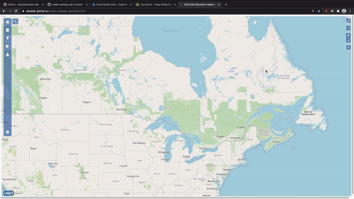

# GIS Simulation Explorer (DRAFT)

## Purpose

Build a GIS environment based visualization for large scale spatial simulations on the web. 

## Getting Started:

### Users

- Open the [GIS Simulation Explorer](https://staubibr.github.io/arslab-web/app-gis/index.html) in Chrome 
- OpenStreetMap will automatically load the world map
- Before Loading Simulations
  - You can change the number of classes and color scale
- Load Simulation 
  1. Click the database icon in the map's sidebar
  2. Drag and Drop your simulation results (.txt) and layer (.geojson)
  3. Click the `Load Simulation` button
  4. OPTIONAL: Repeat step 2 to 3
- Manipulating Simulations
  - Click the filter icon in the sidebar
  - By default, the current simulation to be manipulated is the most recently loaded one
  - The current simulation can be selected which will allow you to:
    - Download simulation object as a csv file
    - Cycle through different timestamps of the SIR simulation
    - Change legend
    - Change color
- Download Simulation
  - Click the download icon in the sidebar
  - Choose which simulation to download
  - Click the `Download` button
- Interacting with Simulations Shown on Map
    - View attributes by clicking census subdivisions
- Layer switcher 
  - Click the second icon in the top right corner of the Application
  - Use this for changing between simulations (view-only)
- Search 
  - Click the search icon shown in the Application
  - You can move anywhere on the map by typing in a location
- Playback 
  - Click the play button in the sidebar 
  - This will give you the ability to record the Application as it goes through simulation cycles

### Developers

##### Essentials:
- Download [Web Server for Chrome](https://chrome.google.com/webstore/detail/web-server-for-chrome/ofhbbkphhbklhfoeikjpcbhemlocgigb) or [Live Server in VSCode](https://marketplace.visualstudio.com/items?itemName=ritwickdey.LiveServer)
- Open [app-gis](https://github.com/staubibr/arslab-web/tree/master/app-gis) in your preferred text editor 
- Use [Chrome DevTools](https://developers.google.com/web/tools/chrome-devtools/) for debugging
  - Ensure that cache is disabled in DevTools

##### Running the local server (Web Server Chrome):
> Open Chrome and go to Apps

>> Click Web Server

>>> Set the current folder to /arslab-web 

>>>> Open Web Server for Chrome by clicking the Web Server URL

##### Running the local server (Live Server in VSCode):

> Open VS Code and set the current folder to /arslab-web 

>> Click Go Live on the bottom right corner of VS Code 

>>> In your default web browser, localhost should open

>>>> In the web browser's listing directory, click /app-gis

##### Development:

Features: 
  - OpenStreetMap as base layer / canvas
    - Zoom in/out
    - Layer Switcher
    - Search bar
    - Sidebar 
      - Home 
      - Load Simulation 
      - Manipulating Simulations
        - Color
        - Classes
        - SIR
      - Download Simulation
      - Playback
    - Legend
    - Interacting with Simulations Shown on Map

##### Structure of Simulation Results Text File:
    State for model _DAUID is <population, number of susceptible, number of infected, number of recovered, number of new infected, number new recovered, number fatalities>
    
    Note:

    - The population changes throughout the results file. 

    - The geojson file you loaded would likely have the initial population for the census subdivision.
    
    - The population formula is (population - population * fatalities)

## TODO:
1. General bug fixes, UI changes, and code refactoring 
2. Fix mapOnClick
   - Code gets wanky when layers are on top of each other
   - The issue could likely be fixed by looking at the layer switcher
3. Let users title their simulation 
4. Let users choose what their simulation object will contain
5. Add options to the Settings tab
   - Support for multiple languages 
6. Allow geopackage files as an accepted file format
   - Look into [GeoPackage JS](https://github.com/ngageoint/geopackage-js)
   - For now use [MyGeodata Converter](https://mygeodata.cloud/converter/gpkg-to-geojson) or QGIS to convert .gpkg to .geojson
   - Could also create a [Python script](https://www.geodose.com/2020/06/pyqgis-tutorial-shapefile-conversion.html) for the time being?
7. Add a GeoCoder
8. Integrate with DEVS Web Viewer
   - Incorporate library of models w/ backend
9.  Introduce spatial analysis tools

## Credits and Acknowledgements

[Carleton University - ARSLab](https://arslab.sce.carleton.ca/)

[Tobias Bieniek - Sidebar-v2](https://github.com/Turbo87/sidebar-v2)

[Jean-Marc Viglino - OpenLayers Extension](https://github.com/Viglino/ol-ext)

[Matt Walker - OpenLayers Popup](https://github.com/walkermatt/ol-popup)

[OpenLayers](https://openlayers.org/)

[D3JS](https://d3js.org/)

## Resources:

#### D3JS 

[D3 Scale](https://github.com/d3/d3-scale)

[D3 Full Video Tutorial](https://www.youtube.com/watch?v=_8V5o2UHG0E)

#### GIS

[Spatial references](https://spatialreference.org/ref/epsg/)

#### OpenLayers

**Note:** Coordinate format is Longitude / Latitude. 

[ol.Map](https://openlayers.org/en/latest/apidoc/module-ol_Map-Map.html)  

[ol.layer.Vector](https://openlayers.org/en/latest/apidoc/module-ol_layer_Vector-VectorLayer.html)

[ol.OverLay](https://openlayers.org/en/latest/apidoc/module-ol_Overlay-Overlay.html)

[ol.layerswitcher](https://github.com/walkermatt/ol-layerswitcher)

[ol.control.Sidebar](https://github.com/Turbo87/sidebar-v2/blob/master/doc/usage.md)

[3rd Party Extensions](https://openlayers.org/3rd-party/)

#### Web Development

[JavaScript - Event References](https://developer.mozilla.org/en-US/docs/Web/Events)

